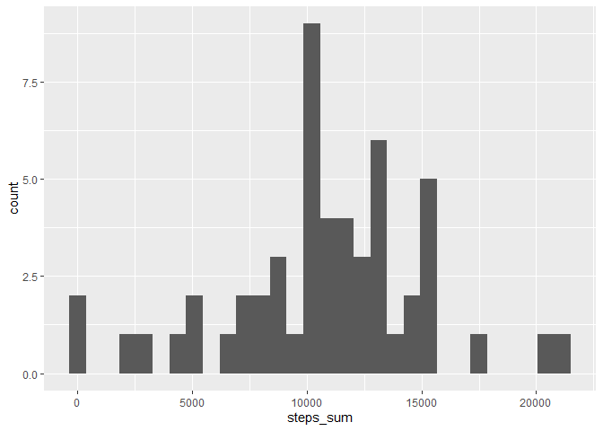
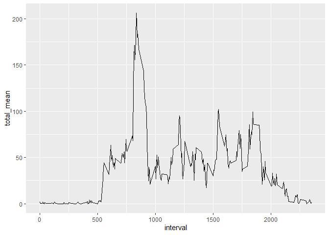
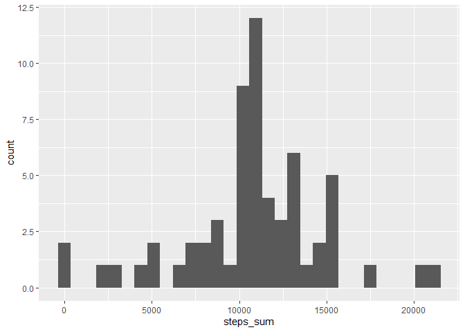
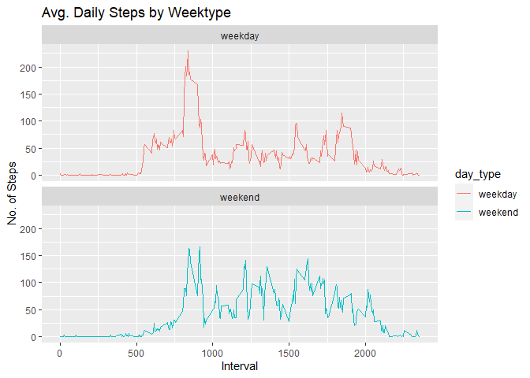

## Loading and preprocessing the data

```r
library(dplyr)
library(ggplot2)

data <- read.csv("activity.csv") %>%
  mutate(date = as.Date(date),
         steps = as.numeric(steps),
         day_type = as.factor(
          if_else(weekdays(date) %in% c("lørdag","søndag"),"weekend","weekday")),
         )

head(data)
```

```
##   steps       date interval day_type
## 1    NA 2012-10-01        0  weekday
## 2    NA 2012-10-01        5  weekday
## 3    NA 2012-10-01       10  weekday
## 4    NA 2012-10-01       15  weekday
## 5    NA 2012-10-01       20  weekday
## 6    NA 2012-10-01       25  weekday
```

## What is mean total number of steps taken per day?
I first plot a simple histogram and then print the summary below, that contaion mean and median.

```r
total_steps_day <- data %>%
  group_by(date) %>%
  summarise(steps_sum = sum(steps))

ggplot(total_steps_day, aes(steps_sum)) +
  geom_histogram()
```

<!-- -->

```r
summary(total_steps_day)
```

```
##       date              steps_sum    
##  Min.   :2012-10-01   Min.   :   41  
##  1st Qu.:2012-10-16   1st Qu.: 8841  
##  Median :2012-10-31   Median :10765  
##  Mean   :2012-10-31   Mean   :10766  
##  3rd Qu.:2012-11-15   3rd Qu.:13294  
##  Max.   :2012-11-30   Max.   :21194  
##                       NA's   :8
```
## What is the average daily activity pattern?
I first plot the average daily pattern, and the print the row showing the interval with the highest average.

```r
total_steps_interval <- data %>%
  group_by(interval) %>%
  summarise(total_mean = mean(steps, na.rm = TRUE))
  
ggplot(total_steps_interval, aes(x=interval, y=total_mean)) +
  geom_line()
```

<!-- -->

```r
total_steps_interval %>%
  arrange(desc(total_mean)) %>%
  top_n(1)
```

```
## # A tibble: 1 x 2
##   interval total_mean
##      <int>      <dbl>
## 1      835       206.
```

## Imputing missing values
I first find the number of rows with NAs. Since I already have the mean of each interval I choose to impute by that. Simply by joining in the table above. The summary of the resulting table with imputed NAs shows no difference from the table with NAs (only 1 in the median).

```r
data_imputed <- data %>%
  left_join(total_steps_interval, by="interval") %>%
  mutate(steps_imputed = if_else(is.na(steps),total_mean,steps))

total_steps_day_imputed <- data_imputed %>%
  group_by(date) %>%
  summarise(steps_sum = sum(steps_imputed))

ggplot(total_steps_day_imputed, aes(steps_sum)) +
  geom_histogram()
```

<!-- -->

```r
summary(total_steps_day_imputed)
```

```
##       date              steps_sum    
##  Min.   :2012-10-01   Min.   :   41  
##  1st Qu.:2012-10-16   1st Qu.: 9819  
##  Median :2012-10-31   Median :10766  
##  Mean   :2012-10-31   Mean   :10766  
##  3rd Qu.:2012-11-15   3rd Qu.:12811  
##  Max.   :2012-11-30   Max.   :21194
```

## Are there differences in activity patterns between weekdays and weekends?
The factor variable is already created when loading data. The plot looks like this:

```r
data_imputed_weekday <- data_imputed %>%
  group_by(day_type,interval) %>%
  summarise(total_mean = mean(steps_imputed))

ggplot(data_imputed_weekday, aes(x = interval , y = total_mean, color=`day_type`)) + 
  geom_line() + 
  labs(title = "Avg. Daily Steps by Weektype", x = "Interval", y = "No. of Steps") + 
  facet_wrap(~day_type , ncol = 1, nrow=2)
```

<!-- -->
